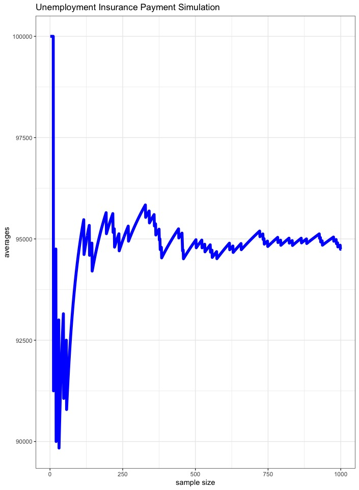
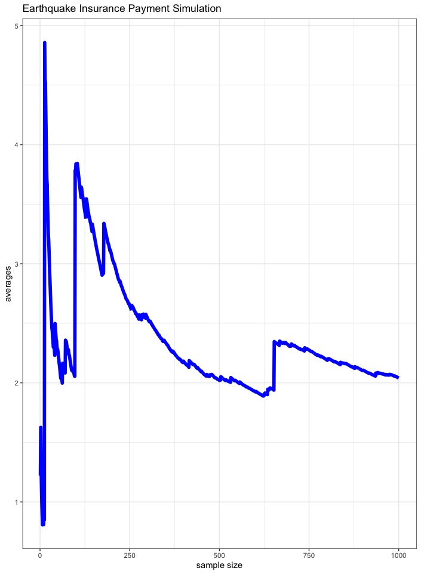

# ミクロデータサイエンス課題
- 廣江友哉
- 2125178


## functionの活用と可読性の向上

### (1)リファクタリング
同様のコードが、assignment1/refactoring.Rに書いてあります。
```{r}
successP <- function(error_probability, number) {
  return (1 - (error_probability ^ number))
}
P1 <- 0.05
P2 <- 0.05
N2 <- 5000
N1 <- 5

successP(P1, N1)
successP(P2, N2)
```

### (2)ボーナス問題
- 場合１の成功確率は、 0.9999997
- 場合２の成功確率は、1

## 中身極限定理と保険の可能性

### (a)(b)ソースコードの修正

```{r}
## 以下3つの関数の誤りを修正
define_unemployment <- function(param) {
  
  quantile_unemployment <- function(q) {
    if (q < param$unemployment_risk) {
      Y <- -param$insurance_premium
    } else {
      Y <- param$insurance_provision
    }
    return(Y)
  }
  return(quantile_unemployment)
  
}
```




**上記の画像のように、約500人以上いると大体安定した雇用保険の運用ができると考えられます。**

### (c) 現実と乖離しえる仮定

現実には失業率が一定ということはなく、時代の大きな出来事によって一時的に失業率が大きく増加することが考えられます。たとえば、2008年のリーマンショックやバブル崩壊などが挙げられます。

### (d)コードの修正とシミュレーション

```{r}
define_earthquake <- function(param) {
  quantile_earthquake <- function(q) {
    Y <- param$payment_fraction * (1 - q)^(-1/param$alpha)
    return(Y)
  }
  return(quantile_earthquake)
}

define_simulator <- function(param) {
  simulate_distribution <- function(quantile) {
    set.seed(param$num.seed)
    q.unif <- runif(param$N.simulate)
    data_simulated <- matrix(0, 1, param$N.simulate)
    
    for (i in 1:param$N.simulate) {
      q <- q.unif[i]
      data_simulated[i] <- quantile(q)
    }
    return(data_simulated)
  }
  return(simulate_distribution)
}
```

加入世帯が多いと支払い多少安定する傾向がありますが、それほど安定しているとは言えない。

### (e)現実に地震保険を成り立たせるためには

過去に支払ってきた保険金の額と、被害の度合いに合わせて支払額を変えるモデルを作成することで、現実に即した地震保険を成り立たせることができると考えました。

### (f)set_seedの意義

結果を再現可能にするという意義があります。

## 生成AIについての思索

### (a) プログラミングを学ぶ意義

たとえ生成AIなどによって分析レポートが手動で作成されなくなったとしても、レポートの統計的正しさや、分析のためのソースコードの正しさをチェックするためにデータ分析プログラミングを学ぶ意義は大いにあると思います。
間違った統計情報をきちんと判別できるように、そのような目を養えるように意識しながら学習を進めることが適切だと思います。

### (b) 鉄腕アトムから考えるAI規制

議論したいのですが、鉄腕アトムを読んだことがありません。Wikipediaであらすじをさらったのでそれを元に論じようと思います。
まず、AI規制の可能性ですが、これはおそらく、「AIを完全には規制できないが、進歩を遅らせることで、社会がAIを受容するための準備時間を作る」というものだと推測できます。上記の可能性は間違いなくありますが、完全に規制をすることの限界も同時に示しています。
AIを規制しようとする人々の中には、AIが感情を宿して人に変わるのではないかと危惧する方もいるかもしれないですし、天馬博士のように可能ならば死んだ息子を蘇らせたいと思いAIに期待をしている人もいるかもしれません。

ロボットは感情を持ちうるか、という問いに対してはあらすじを読んだ段階では、「限定的な感情なら持ちうる」という答えを示しているように感じました。というのも、アトムは自然に対する畏怖などの複雑な感情を抱けないという設定になっていたそうです。

